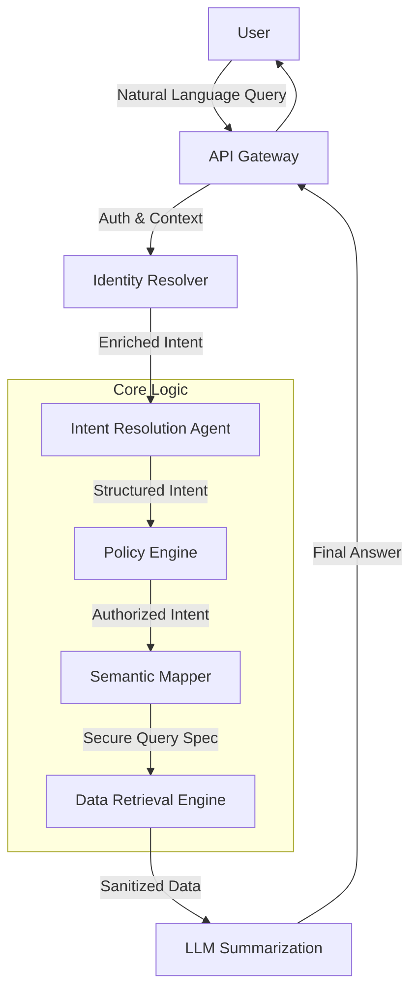

# Sutradhara: Domain-Agnostic AI Data Access Platform

**Sutradhara** ("The Orchestrator") is an intelligent, secure bridge between natural language user queries and enterprise structured data. Unlike simple Text-to-SQL tools, Sutradhara enforces strict governance, row-level security, and semantic understanding before any data is retrieved.

> **Mission:** To democratize access to enterprise data while maintaining Zero Trust security and complete auditability.

---

## 🏗 High-Level Architecture

Sutradhara operates on a **decoupled architecture** where the LLM is treated as an untrusted translator, not an executor.



## 🚀 Key Features

*   **🔒 Zero Direct Access:** LLMs never execute SQL directly. They output structured intent which is validated.
*   **🛡 Policy-Driven Governance:** Integration with **Open Policy Agent (OPA)** ensures that users only query what they are explicitly allowed to see (Row-Level Security).
*   **🧠 Schema Awareness:** Semantic layer maps "business concepts" (e.g., "Churn Risk") to physical tables and columns.
*   **🔌 Domain Agnostic:** Truly generic. Configure it for Education, Finance, or Logistics via metadata, not code changes.
*   **📝 Full Auditability:** Every step from intent resolution to SQL generation is logged for compliance.

---

## 🛠 Technical Stack & Ecosystem

Sutradhara is built by orchestrating best-in-class open-source components:

| Component | Technology | Role |
| :--- | :--- | :--- |
| **Orchestration** | **LangGraph** / **LangChain** | Managing result flow and agent state. |
| **Intent Resolution** | **Open Data QnA** (Google) | Converting NL to rigid SQL-like intent structures. |
| **Policy Engine** | **Open Policy Agent (OPA)** | Enforcing RBAC and ABAC policies on intents. |
| **Data Connectivity** | **MindsDB** | connecting to 200+ data sources (Postgres, Snowflake, Mongo). |
| **API Layer** | **FastAPI** (Python) | High-performance async API gateway. |
| **Identity** | **OAuth2 / JWT** | Carrying user context (Tenancy, Roles) across layers. |

---

## 📂 Project Structure

Verified, standard project layout for scalability:

```bash
sutradhara/
├── docs/                   # Architecture designs and requirement specs
├── src/
│   ├── gateway/            # FastAPI entry points and middleware
│   ├── agents/             # LangGraph definitions for Intent/Summary
│   ├── policy/             # OPA Rego files and enforcement logic
│   ├── semantics/          # YAML configs for domain entities & schemas
│   └── retrieval/          # SQL generation and MindsDB connectors
├── tests/                  # Integration and E2E tests
├── scripts/                # Deployment and DB migration scripts
├── docker-compose.yml      # Local development stack (DB, API, MindsDB)
├── requirements.txt        # Python dependencies
└── README.md               # This file
```

---

## ⚡️ Getting Started

### Prerequisites
*   Python 3.10+
*   Docker & Docker Compose
*   Access to an LLM Provider (OpenAI API key or local Ollama)

### Installation

1.  **Clone the repository**
    ```bash
    git clone https://github.com/Mypatasala/sutradhara.git
    cd sutradhara
    ```

2.  **Set up Environment**
    ```bash
    cp .env.example .env
    # Edit .env with your LLM_API_KEY and DATABASE_URL
    ```

3.  **Install Dependencies**
    ```bash
    pip install -r requirements.txt
    ```

4.  **Run Local Cluster**
    ```bash
    docker-compose up -d
    ```

5.  **Start API Server**
    ```bash
    uvicorn src.gateway.main:app --reload
    ```

---

## 🤝 Contributing

We welcome contributions! Please see `CONTRIBUTING.md` for details on how to submit Pull Requests and our code of conduct.

## 📄 License

This project is licensed under the MIT License - see the `LICENSE` file for details.
